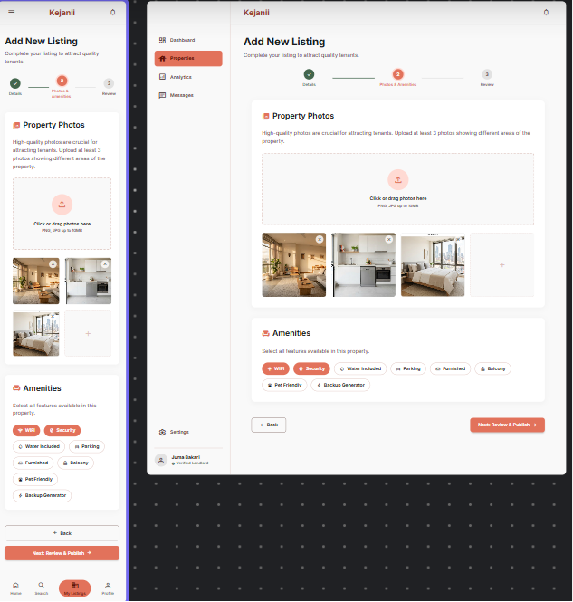
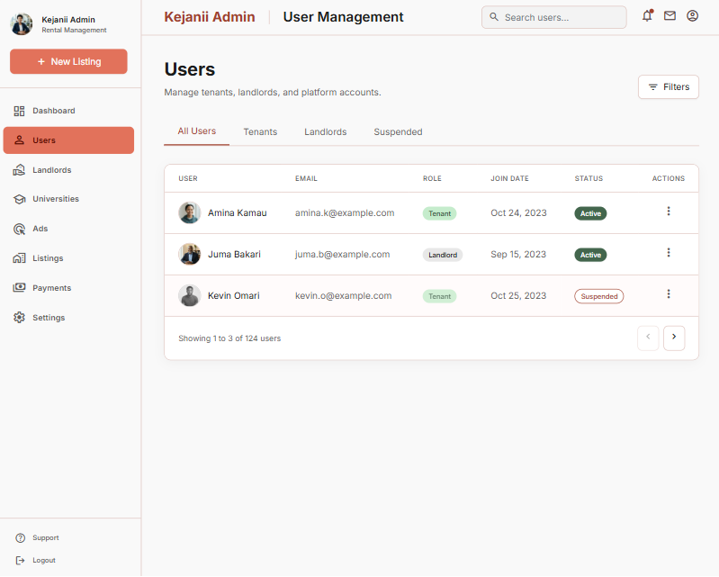
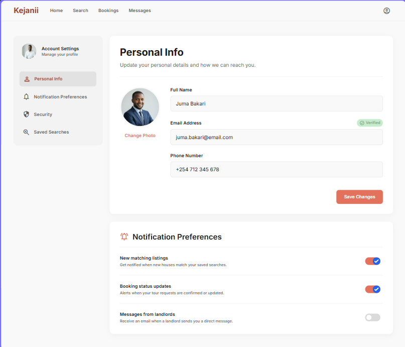
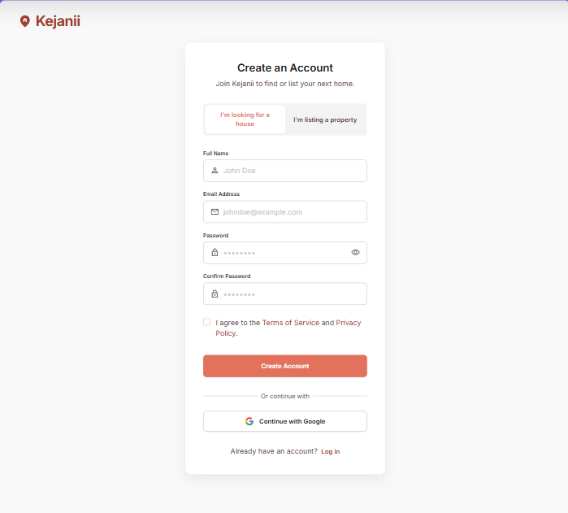
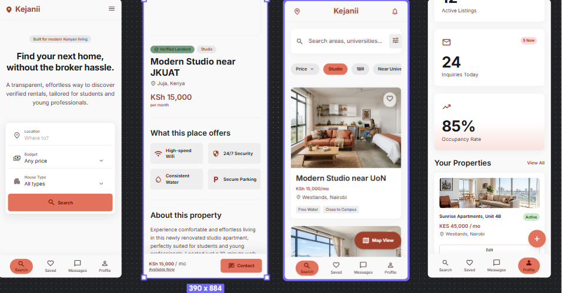

## 🏠 **Kejanii** 

## **A Smart House Hunting Platform for Students and Residents** 

## **1. Executive Summary** 

**Kejanii** is a web-based platform (with a future mobile application) that helps students and residents find rental houses quickly and safely while enabling landlords to advertise vacant properties. 

## 📸 Homepage

The platform solves the traditional challenges of house hunting by allowing users to search, compare, and contact landlords directly from their phones or computers. 

Beyond house listings, the platform will include: 

- 🎓 University Housing Portal 

- 📢 Advertisement Platform 

- 📢 AI-powered recommendations 

- 📢 Interactive Maps 

- 💳 M-Pesa Payments 

- ⭐ Reviews and Ratings 

- 📈 Analytics for landlords 

## 🏡 Property Listing

The long-term vision is to become **Kenya's largest rental discovery platform** . 

## 🛠️ Admin Dashboard

## ⚙️ Profile Settings

## 👤 Register & Login

## **a future mobile application**
## 📱 Mobile Mockup

## **2. Problems We're Solving** 

## **For Students** 

- Walking around searching for houses 

- Paying brokers 

- Fake listings 

- No way to compare houses 

- No information about security 

- No verified landlords 

## **For Residents** 

- Limited knowledge of available rentals 

- Hard to compare prices 

- No centralized rental platform 

## **For Landlords** 

- Empty houses take too long to rent 

- Expensive advertising 

- Too many unnecessary phone calls 

- No marketing analytics 

## **For Universities** 

- Students ask where to get accommodation 

- Universities don't have trusted off-campus housing information 

## **3. Target Users** 

- University students 

- College students 

- Families 

- Working professionals 

- Landlords 

- Property managers 

- Universities 

- Businesses advertising housing-related services 

